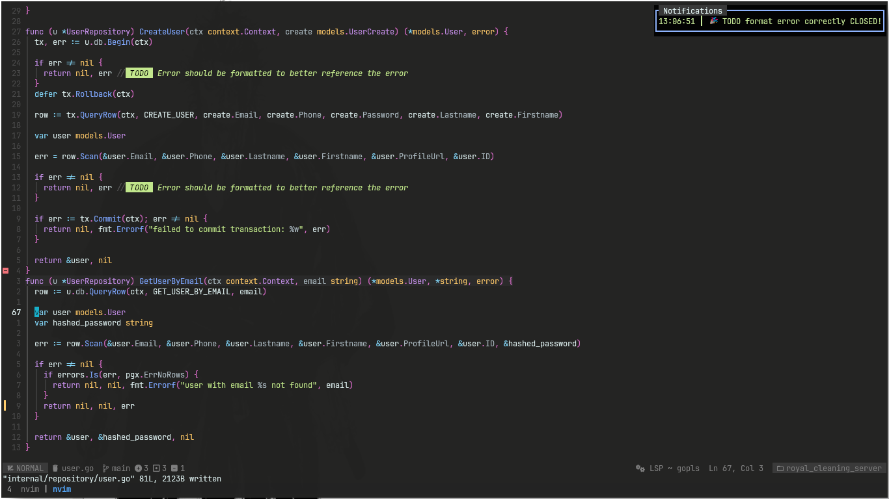

# 🎉 cheer.nvim

> Because closing TODOs should feel like winning!

**cheer.nvim** is a Neovim plugin that plays a cheerful sound and displays a message whenever you close a label like `TODO`, `FIXME`, or `BUG`. It's a fun, positive reinforcement tool for your daily coding grind.



## ✨ Features

- 🔔 Plays an audio cheer when a label is closed.
- 🏷️ Supports custom labels (e.g., `HACK`, `NOTE`, `DEPRECATED`, etc.).
- 🔊 Choose between built-in cheer sounds.
- 🧠 Ignores specific filetypes (like commit messages or Telescope).
- 🎶 Fully customizable sound player and file.

## 🚀 Installation

Using [lazy.nvim](https://github.com/folke/lazy.nvim):

```lua
{
  "Ayobami0/cheer.nvim",
  lazy = false,
  dependencies = {
    {
      "echasnovski/mini.notify", -- optional
      version = false,
      config = function()
        local mini = require("mini.notify")
        mini.setup()
        vim.notify = mini.make_notify()
      end,
    },
  },
}
```

## 🛠️ Configuration

Here's the default configuration:

```lua
require("cheer").setup({
  player = {
    cmd = "mpv",                  -- your audio player
    args = { "--ao=pulse" },     -- player args
  },
  ignore = {
    "^$", "NvimTree", "Neogit*", "markdown", "COMMIT*", "Telescope*"
  },
  cheer_format = "🎉 {label} {message} CLOSED on line {line}!",
  cheer_song = "cheer_applause", -- or custom file path
  labels = {
    TODO = nil,
    FIXME = nil,
    BUG = nil,
    HACK = nil,
    NOTE = nil,
    DEPRECATED = nil,
    REFACTOR = nil,
    OPTIMIZE = nil,
    WIP = nil,
    QUESTION = nil,
  },
})
```

### 🧩 Format String Parameters
You can customize the celebration message using placeholders in cheer_format. These will be dynamically replaced when a label is closed.

Available placeholders:
- `{label}` – The label that was closed (e.g., TODO, FIXME, etc.)
- `{message}` – The remaining message text on the label line
- `{line}` – The line number where the label was closed
- `{file}` – The file containing the label

#### Example:
```lua
cheer_format = "🎉 {label} '{message}' closed on line {line}!"
```
Would result in:
`🎉 TODO 'fix off-by-one error' closed on line 32!`

### 🎯 Label-Specific Configuration

You can override the global `cheer_format` and `cheer_song` **per label** by providing a table for that label inside the `labels` field.

This allows you to make certain labels sound different or have unique messages.

#### Example:

```lua
labels = {
  TODO = {
    cheer_format = "✅ Task completed: {message} (line {line})",
    cheer_song = "cheer_yay",
  },
  FIXME = {
    cheer_format = "🐛 Squashed a bug on line {line}: {message}",
    cheer_song = "cheer_clap",
  },
  BUG = nil, -- will fallback to global settings
}
```
### 🔉 Supported cheers

You can use any of the built-in cheers:

- `cheer_applause`
- `cheer_clap`
- `cheer_group`
- `cheer_yay`

Or provide your own `.mp3` file path.

## 🔍 How it works

When you remove or comment out a line with a registered label (e.g., `-- TODO: fix the bug`), `cheer.nvim` will:

1. Display a notification like `🎉 TODO fix the bug CLOSED on line 42!`
2. Play a cheer sound.

## 🧪 TODOs

- [ ] Add visual cheering animations (ASCII fireworks?).
- [ ] Add Vimscript-compatible interface.

## 📁 File Structure

Cheer sounds are located in the `lua/cheer/cheers/` directory. You can add your own `.mp3` files and reference them in `cheer_song`.

## ❤️ Contributing

Issues, feature requests, and PRs are welcome! If you've got a new cheer sound or label idea, bring it on.

---
